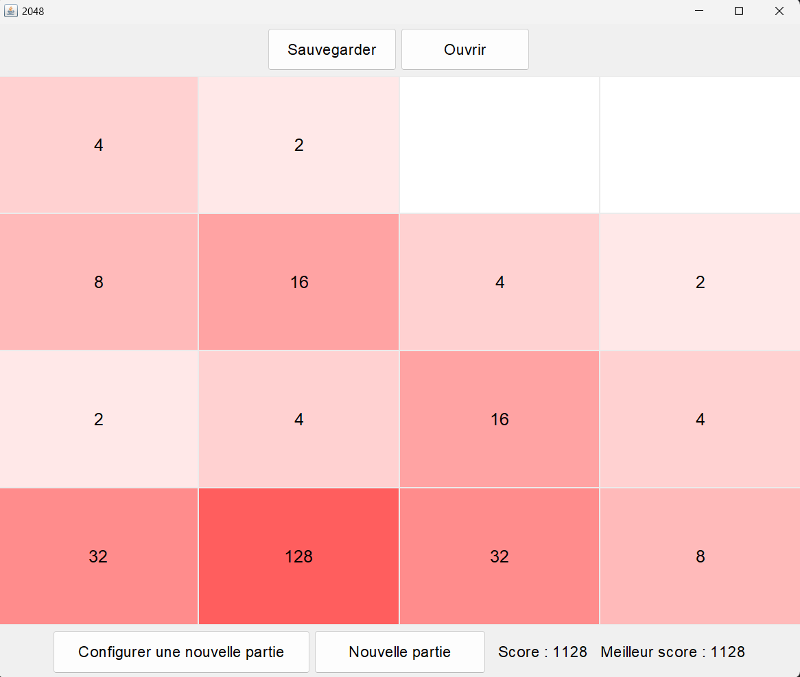

# 2048 in Java

Coding the famous 2048 game in Java.


## Installation & Test

Having the JDK installed on your computer is required to test the project.

#### Navigate to the directory of your choice with 

```bash
  cd yourPath  
```
#### Clone the project in the directory

```bash
  git clone https://github.com/Nathmaxx/2048
  cd 2048
```
#### Run the project

```bash
  java --enable-preview -cp bin Vue.LancerFenetre
```
    


